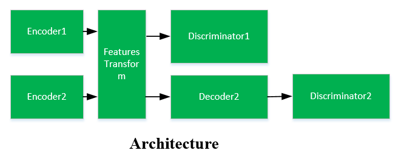

#Cartoon-video-make<br>
 CartoonGAN(http://203.187.160.133:9011/openaccess.thecvf.com/c3pr90ntc0td/content_cvpr_2018/papers/Chen_CartoonGAN_Generative_Adversarial_CVPR_2018_paper.pdf)是非常优秀的自然图像转换成动漫图像的算法，由于生成器除了上下采样还要接
八个残差模块，导致模型不能满足实时性的要求，通过几点改进使得原来的模型能够适应视频的动漫化.

Network:
----


- 跟Cartoon相似，得到的图像一共有三个集合，一个集合是自然图像，一个是动漫图像，还有一个集合是经过预处理的图像集合.Encoder1接收输入的自然  
  图像，Encoder2接收真正的动漫图像。
- Decoder2用来对图像的特征进行解码，因此：Encoder2-Decoder2看起来是一个自编玛器，Encoder1-Decoder2看起来是一个图像跨域转换。
- Discriminator1 别用来判断接收自Encoder1跟Encoder2图像的真实程度，即使得由Encoder1接收的图像特征跟Encoder2接收的图像足够相似。
- Discriminator2 跟CartoonGAN相同。

Train:
----
```
    python train.py --input1 {} --input2 {}
```

Test:
---
```
    python test.py --input {}
```
Results:

Reference:
